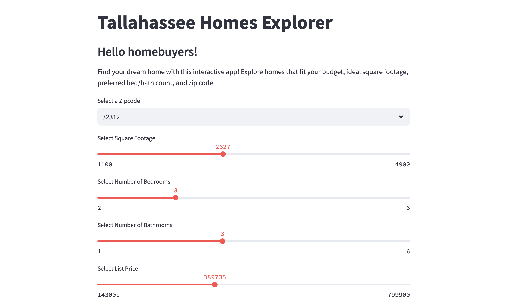

# Welcome to the Tallahassee Homes Explorer!


## Contents: 
- [Project Overview](#project-overview)
- [App Features](#app-features)
- [Instructions](#instructions)
- [Visuals](#visuals)
- [Dataset](#dataset)
- [References](#references)

## Project Overview 
This project focuses on building a **Basic Streamlit App** that allows users to interactively explore real estate listings in the Tallahassee area. The goal was to create a simple yet functional app to assist users in their home search.

**Tallahassee Homes Explorer** enables users to filter home listings by customizable preferences such as **zip code, number of bedrooms and bathrooms, square footage, and price**. 

## App Features

#### Personalized Search  
Users can filter homes based on **zip code, bedrooms, bathrooms, square footage, and price** to find listings that match their exact preferences.

#### Explore Similar Options  
The app provides **alternative suggestions**—homes that fall outside exact search parameters but might still be a good fit (e.g., nearby zip codes, slightly different price ranges or sizes).

#### Clean and Intuitive UI  
Designed with **user-friendliness** in mind, the app offers a responsive and easy-to-navigate interface that simplifies the home-searching experience.

**Together, these features create an efficient, customizable, and stress-free home search tool tailored to the user's needs.**

## Instructions 
To run this app, you can either run the app locally or access the deployed version. The instructions for each are below.  

### Option 1: Running the App Locally 

1. Clone or download the `main.py` file from this GitHub repository to your local machine.

2. Install the necessary libraries by running the following commands in your terminal:

    ```bash
    pip install streamlit
    pip install pandas
    ```

3. Run the app:
    ```bash
    streamlit run main.py
    ```

4. Open your browser and go to `http://localhost:8501` to interact with the app.

### Option 2: Accessing the Deployed Version

1. Open the deployed version of the app on Streamlit Community Cloud using this [link](https://yamanaka-python-portfolio-sng6b4fbwnlbxvfrgxg4bm.streamlit.app) 

## Visuals 

### App Interface:


## Dataset:
The dataset used was [zillow.csv](https://people.sc.fsu.edu/~jburkardt/data/csv/zillow.csv) from a CSV File Directory made by Florida State University. The dataset includes Tallahassee housing prices as reported by Zillow. There were 20 records that included:
- Index
- Square footage
- Beds
- Baths
- Zip Code
- Year
- List Price

More research was then conducted to add in more records using [Zillow](https://www.zillow.com)

## References
- [Streamlit Cheat Sheet](https://docs.streamlit.io/develop/quick-reference/cheat-sheet)
- [Markdown Extended Syntax – Markdown Guide](https://www.markdownguide.org/extended-syntax/)
