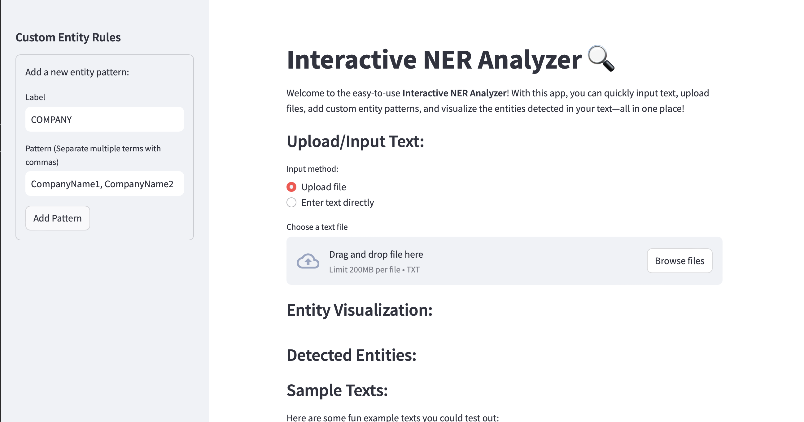
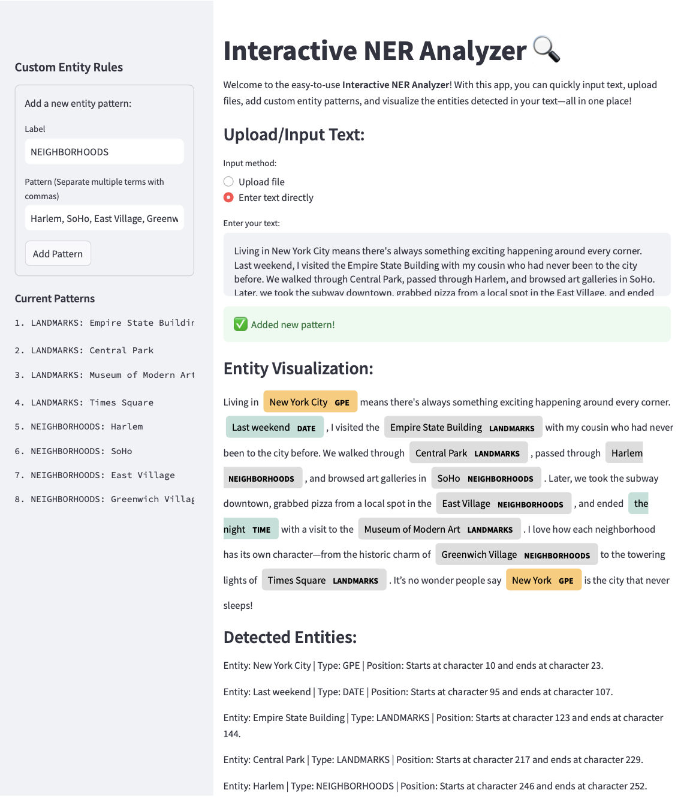
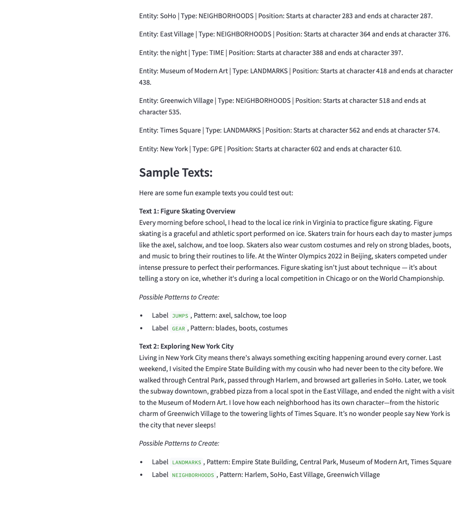

# Named Entity Recognition (NER) App Project


## Contents: 
- [Project Overview](#project-overview)
- [App Features](#app-features)
- [Instructions](#instructions)
- [Visuals](#visuals)
- [References](#references)

## Project Overview 
This project focuses on building a **Customaizable Named Entity Recognition (NER) App**. The goal was to create an interactive app that allows users to upload or input their own text data, define custom entity patterns, and view highlighted entities in the output. 

**Named Entity Recognition (NER)** is a key task in Natural Language Processing (NLP) that involves identifying and classifying specific pieces of information in text—such as names of people, organizations, dates, locations, and monetary values.

### What is spaCy's approach to NER?

spaCy uses a dictionary-based approach for NER, relying on patterns and labels to identify entities. By using the **EntityRuler** component, users can define custom patterns that the app will use to recognize entities in a given text. The EntityRuler matches text against a predefined set of patterns, and if a match is found, it assigns the relevant label (e.g., `PERSON`, `PRODUCT`, `DATE`) to the entity.

- **EntityRuler**: A component in spaCy used to add custom patterns to the NER pipeline. It works by analyzing text and matching predefined patterns, making it possible to recognize domain-specific entities.
- **Patterns**: A list of dictionaries where each dictionary contains:
  - `label`: The type of entity (e.g., `PERSON`, `PRODUCT`, `DATE`).
  - `pattern`: The exact words or terms that should be matched (e.g., "iPhone", "Sakura Yamanaka").

## App Features

#### Upload or Input Text  
Users can either upload a `.txt` file or directly type/paste text into the app for analysis.

#### Define Custom Entity Patterns  
Use the sidebar to create a custom `EntityRuler` by specifying **any number of patterns**.  
Each pattern includes a **label** (e.g., `PRODUCT`, `COMPANY`) and a **pattern** (e.g., `"iPhone, Samsung"` or `"Google, Amazon, Sephora"`).

#### Support for Multi-Word Patterns  
Patterns can include **multiple words**, allowing for recognition of full organization names, titles, or other phrases  
(e.g., `"New York City"` or `"University of Notre Dame"`).

#### Explore Pre-trained NER Model  
The app integrates spaCy’s **`en_core_web_sm` model** to automatically detect common entity types like people, dates, and monetary values.

#### Visualize Entity Spans and Types  
Detected entities are highlighted in a color-coded display using spaCy’s **`displacy` visualizer**.  
Below the visualization, each entity is listed with its type and position in the text.

**Together, these features give users the ability to analyze text with a high degree of flexibility, customization, and precision.**

## Instructions 
To run this app, you can either run the app locally or access the deployed version. The instructions for each are below.  

### Option 1: Running the App Locally 

1. Clone or download the `NERmain.py` file from this GitHub repository to your local machine.

2. Install the necessary libraries by running the following commands in your terminal:

    ```bash
    pip install streamlit
    pip install pandas
    pip install spacy
    python -m spacy download en_core_web_sm
    ```

3. Run the app:
    ```bash
    streamlit run NERmain.py
    ```

4. Open your browser and go to `http://localhost:8501` to interact with the app.

### Option 2: Accessing the Deployed Version

1. Open the deployed version of the app on Streamlit Community Cloud using this [link](https://sakura-yamanaka-yamanaka-python-p-nerstreamlitappnermain-ibtlbw.streamlit.app/) 

## Visuals 

### App Interface:


### Example of Use:  




## References
- [Create a spaCy Visualizer with Streamlit – Medium](https://medium.com/@groxli/create-a-spacy-visualizer-with-streamlit-8b9b41b36745)
- [spaCy EntityRuler](https://spacy.io/api/entityruler)
- [Streamlit Cheat Sheet](https://docs.streamlit.io/develop/quick-reference/cheat-sheet)
- [Python `strip()` Method – W3Schools](https://www.w3schools.com/python/ref_string_strip.asp)
- [Markdown Extended Syntax – Markdown Guide](https://www.markdownguide.org/extended-syntax/)
