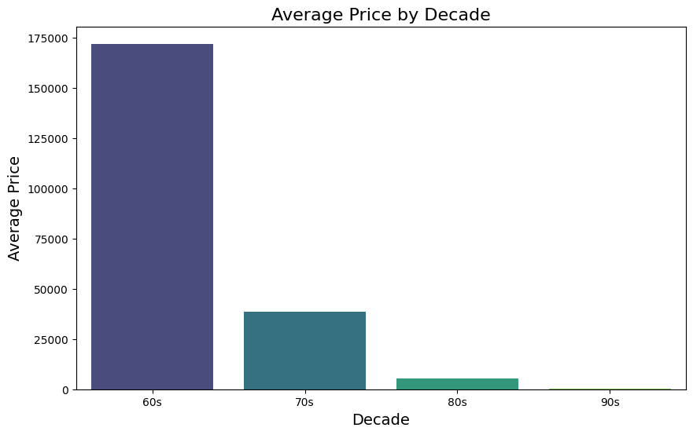
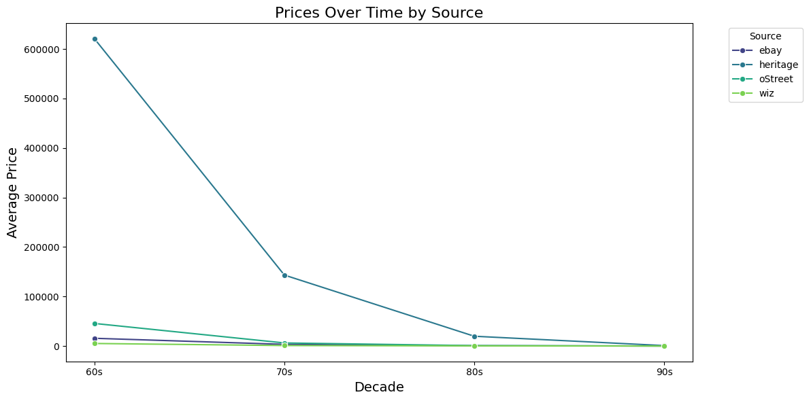

# Tidy Data Project: Mutant Moneyball Data


## Project Overview 
This project focuses on cleaning and tidying a dataset, Mutant Moneyball, which was adapted from GitHub. The dataset holds holds cleaned up data used in the Rally's Mutant Moneyball article which has X-Men value data from the X-Men's creation in 1963 up to 1993. 

The goal of this project is to transform a wide, untidy datset into a tidy format, making it easier to analyze and visualize. The project demonstrates our understanding of tidy data principles such as:
- Each variable forms a column
- Each observatuon forms a row
- Each type of observational unit forms a table

## Instructions 
To run this notebook, follow these steps:

### Step 1: Set Up 
1. **Make a Copy of the Notebook:**
- Open the Jupyter Notebook (`Yamanaka_TidyDataProject.ipynb`) in your preferred environment (e.g., Google Colab, Jupyter Lab, or Jupyter Notebook).

2. **Download the Dataset:**
- Download the dataset `mutant_moneyball.csv` from this repository 

3. **Install Dependencies:**
Ensure that you have the following Python libraries installed:
- Pandas
- Seaborn
- Matplotlib

You can install them with the following code:
pip install pandas seaborn matplotlib

These libraries are essential for data manipulation, cleaning, and visualizations. 

### Step 2: Run the Notebook 
1. **Follow and run the notebook cells sequentially to:**
- Load and upload the dataset
- Melt the datset into a tidy format
- Clean and transform the data
- Create visualizations
- Generate a pivot table 

**Additionally,** you can use the comments throughout the notebook to help explain what steps I took and why they were important. 

## Data Description 
The dataset mutant_moneyball.csv is adapted from the Mutant Moneyball Open Data repository on Github. The original dataset holds all the cleaned up data used in the Rally article Mutant Moneyball: The Search for the Most Valuable X-Men Team. It includes information about the value of X-Men comic books from 1963 to 1993, cateogrized by decade and source (Heritage Auctions, eBay, Wizard Price Guide, and Overstreet Price Guide). 

### Dataset Variables
The dataset contains the following variables related to the value of X-Men comic books across different decades and sources (information sourced from Mutant Moneyball Open Data Github Repository): 

| Variable Name | Summary |
|--------|---------|
|Member  | The name of the X-Men team member the data is connected to. |
|TotalValue60s_heritage | Total value of each X-Men team member's total number of issues as reflected by Heritage highest sale of comics released between 1963 and 1969.|
|TotalValue70s_heritage | Total value of each X-Men team member's total number of issues as reflected by Heritage highest sale of comics released between 1970 and 1979. |
|TotalValue80s_heritage | Total value of each X-Men team member's total number of issues as reflected by Heritage highest sale of comics released between 1980 and 1989. |
|TotalValue90s_heritage | Total value of each X-Men team member's total number of issues as reflected by Heritage highest sale of comics released between 1990 and 1992. |
|TotalValue60s_ebay | Total value of each X-Men team member's total number of issues released between 1963 and 1969 as reflected by ebay sales in 2022 in which sellers tagged the issue as VG (Very Good) Condition. |
|TotalValue70s_ebay | Total value of each X-Men team member's total number of issues released between 1970 and 1979 as reflected by ebay sales in 2022 in which sellers tagged the issue as VG (Very Good) Condition. |
|TotalValue80s_ebay | Total value of each X-Men team member's total number of issues released between 1980 and 1989 as reflected by ebay sales in 2022 in which sellers tagged the issue as VG (Very Good) Condition. |
|TotalValue90s_ebay | Total value of each X-Men team member's total number of issues released between 1990 and 1992 as reflected by ebay sales in 2022 in which sellers tagged the issue as VG (Very Good) Condition. |
|TotalValue60s_wiz | Total value of each X-Men team member's total number of issues released between 1963 and 1969 as they were valued in April 1993's Wizard Price Guide. |
|TotalValue70s_wiz | Total value of each X-Men team member's total number of issues released between 1970 and 1979 as they were valued in April 1993's Wizard Price Guide. |
|TotalValue80s_wiz | Total value of each X-Men team member's total number of issues released between 1980 and 1989 as they were valued in April 1993's Wizard Price Guide. |
|TotalValue90s_wiz | Total value of each X-Men team member's total number of issues released between 1990 and 1992 as they were valued in April 1993's Wizard Price Guide. |
|TotalValue60s_oStreet | Total value of each X-Men team member's total number of issues released between 1963 and 1969 as they were valued in 2015's Overstreet Price Guide.|
|TotalValue70s_oStreet | Total value of each X-Men team member's total number of issues released between 1970 and 1979 as they were valued in 2015's Overstreet Price Guide. |
|TotalValue80s_oStreet | Total value of each X-Men team member's total number of issues released between 1980 and 1989 as they were valued in 2015's Overstreet Price Guide. |
|TotalValue90s_oStreet | Total value of each X-Men team member's total number of issues released between 1990 and 1992 as they were valued in 2015's Overstreet Price Guide. |

## Visuals

### Visualizations





### Code Snippet: Melting the DataFrame
```python
# Melt the DataFrame
df_cleaned = pd.melt(df, id_vars=["Member"],
                       value_vars=["TotalValue60s_heritage",	"TotalValue70s_heritage",	"TotalValue80s_heritage",	"TotalValue90s_heritage",	"TotalValue60s_ebay",	"TotalValue70s_ebay",	"TotalValue80s_ebay",	"TotalValue90s_ebay",	"TotalValue60s_wiz",	"TotalValue70s_wiz",	"TotalValue80s_wiz",	"TotalValue90s_wiz",	"TotalValue60s_oStreet",	"TotalValue70s_oStreet",	"TotalValue80s_oStreet",	"TotalValue90s_oStreet"],
                       var_name="ValueType", value_name="Price")
#We use pd.melt() to convert the dataset from the wide format to the long format. This is done by specifying:
# - id_vars (Member): the identifier column that remains unchanged
# - value_vars(TotalValue60s_heritage, TotalValue70s_heritage, etc.): These columns contain the values that will be put into a single column in the long format.
# - var_name (ValueType): This creates a new column (ValueType) that stores the names of the original columns being melted (TotalValue60s_heritage becomes a value in the ValueType column). 
# - value_name (Price): Creates a new column (Price) that stores the values from the melted columns.

#Melting the DataFrame is key in transforming the dataset into a tidy format. Tidy data principles state that each variable should be in its own column, and each observation should be in its own row. Melting helps achieve this by restructuring the data into long form. 
#Additonally, long-format data is easier to manipulate, analyze, and visualize. 

# Display the first few rows of the melted DataFrame
df_cleaned.head()
```

## References

- **Tidy Data Principles**: For more information, refer to Hadley Wickham's paper: [Tidy Data](https://vita.had.co.nz/papers/tidy-data.pdf)  
- **Pandas Documentation**: For more information, refer to the [Pandas Cheat Sheet](https://pandas.pydata.org/Pandas_Cheat_Sheet.pdf)  